```mermaid
flowchart TD
    subgraph Current["Hiện trạng: Thủ công hoàn toàn (2 - 3 giờ/ngày bị phân mảnh)"]
        A[1. Người dùng mở app nhận tin: Gmail, Zalo, Discord] --> B[2. Đọc lướt từng tin nhắn / tiêu đề: 5-30s/tin]
        B -->|Bottleneck: Tin nhắn rác, chat phiếm tràn lan| C[3. Tự phân loại và xếp mức ưu tiên thủ công]
        C --> D[4. Gắn sao, pin hoặc tự ghi nhớ tin quan trọng]
        D -->|Handoff: Chuyển tin nhắn thành task thủ công| E[5. Thực hiện việc hoặc tạo task nhắc việc]
        E --> F[6. Vừa làm vừa phải ngó tin nhắn mới liên tục]
        F -->|Bottleneck: Tin mới đẩy trôi tin cũ| G[7. Rà soát cuối ngày để tránh sót deadline]
    end

    style B fill:#ffebee,stroke:#c62828,stroke-width:2px
    style C fill:#ffebee,stroke:#c62828,stroke-width:2px
    style F fill:#ffebee,stroke:#c62828,stroke-width:2px
    style G fill:#ffebee,stroke:#c62828,stroke-width:2px
```

```mermaid
flowchart TD
    subgraph Future["Tương lai: AI Agent + Human-in-the-loop (30 - 45 phút/ngày)"]
        subgraph Machine["1. Rule / Tự động hóa ngầm"]
            F1[Dữ liệu thô từ Zalo, Teams, Discord, Gmail] --> F2[Lọc bỏ spam & hội tụ về Dashboard duy nhất]
        end

        subgraph AI["2. AI Agent Core"]
            F2 --> F3[AI Agent tự động fetch context dự án & danh sách thành viên]
            F3 --> F4[Phân tích ngữ cảnh, gắn tag ưu tiên & gợi ý người chịu trách nhiệm]
        end

        subgraph HumanBoundary["3. Human Boundary (Bắt buộc)"]
            F4 --> F5{Người dùng review Digest:<br>Gợi ý tag & task có đúng?}
            F5 -- "Đồng ý" --> F6[Duyệt tạo Task & gửi thông báo]
            F5 -- "Cần sửa (Fallback)" --> F7[Mở tin nhắn gốc kiểm tra citation & chọn lại tag trong 1']
            F7 --> F6
        end

        subgraph Execution["4. Tự động hóa sau duyệt & Bảo vệ Deep Work"]
            F6 --> F8[Đồng bộ task vào Jira/Trello & gửi tin nhắn định tuyến]
            F8 --> F9[Chế độ Gác cổng Deep Work: Chỉ push tin khẩn cấp]
            F9 --> F10[Báo cáo tổng kết Wrap-up cuối ngày]
        end
    end

    style F3 fill:#e8f5e9,stroke:#2e7d32,stroke-width:2px
    style F4 fill:#e8f5e9,stroke:#2e7d32,stroke-width:2px
    style F5 fill:#fff3e0,stroke:#ef6c00,stroke-width:2px
    style F7 fill:#fff3e0,stroke:#ef6c00,stroke-width:1px
```

# 02 — Group Problem Statement — EasyMessage

> Làm chung 1 bản, mỗi thành viên copy vào repo cá nhân. Đi theo Phase 3 → 6 trong `01-worksheet.md`. Nhóm chỉ chọn **candidate problem** ở Phase 3, viết Problem Statement sau khi validate + vẽ workflow.

## Thành viên nhóm

| STT | Họ và tên | Mã học viên | Vai trò trong nhóm (VD: facilitator, workflow, research, writer) |
|:---:|-----------|:-----------:|---------------------------------------------------------------|
| 1 | Nguyễn Minh Thắng | 2A202602706 | Workflow |
| 2 | Phạm Thành Đạt | 2A202602721 | Research |
| 3 | Nguyễn Đức Tâm | 2A202602921 | Facilitator |
| 4 | Nguyễn Tiến Đạt | 2A202602970 | Research |
| 5 | Nguyễn Thị Vàng | 2A202602897 | Writer |
| 6 | Đậu Quang Ý | 2A202602661 | Writer |

**Candidate problem nhóm chọn (1 câu):**

```text
Những người làm việc/học tập theo dự án thường xuyên bị lỡ các công việc hoặc thông tin quan trọng do bị trôi tin nhắn trong các nhóm chat có quá nhiều "tiếng ồn" (tin nhắn rác, thảo luận không liên quan).
```

---

## Phase 3 — Group Convergence: từ 9-12 candidates về 1

### 3.1. Trình bày top 3 mỗi người (mỗi candidate 1-2 phút)

| # | Người đưa ra | Candidate problem | Người gặp vấn đề | Điểm nghẽn | Cảm nhận nhanh của nhóm |
|---|---|---|---|---|---|
| 1 | Nguyễn Minh Thắng | Viết tay từng test case từ test scenario, tốn thời gian và dễ bỏ sót case biên | Bản thân + QA khi làm nhóm | Bước viết chi tiết từng case + rà soát thiếu case | Dễ hiểu |
| 2 | Nguyễn Minh Thắng | Vẽ diagram/flowchart thủ công từng bước, tốn thời gian canh layout | Bản thân | Tạo shape + nối luồng + canh layout | Dễ ứng dụng |
| 3 | Nguyễn Minh Thắng | Lướt mạng xã hội quá nhiều trong ngày, trễ tiến độ task đã lên kế hoạch | Bản thân | Bị cuốn theo feed, mất khái niệm thời gian | Có sáng tạo |
| 4 | Phạm Thành Đạt | Tin nhắn nhóm từ nhiều nguồn có nhiều thứ không liên quan tới mình, nhưng cũng có những thứ quan trọng | Người hay phải tắt thông báo nhưng lại làm việc liên quan nhiều đến đội, nhóm cần tương tác | Việc đọc lướt bằng mắt tiêu tốn năng lượng chú ý và rất dễ bỏ lọt (miss) những tin không được tag trực tiếp nhưng lại ảnh hưởng đến task đang làm, hoặc bị cuốn vào câu chuyện không liên quan | Đẳng cấp |
| 5 | Phạm Thành Đạt | Người học bị lãng phí thời gian vì phải nghe/đọc lại kiến thức nền tảng đã biết, hoặc bị ngợp do thiếu prerequisites mà giáo trình không chuẩn bị sẵn | Người đang học kỹ năng mới, nâng cao chuyên môn (ôn thi AI thực chiến, học framework mới, tự học qua docs) | Khi bắt đầu chương mới hoặc chuyển sang mảng kiến thức mới có background khác biệt giữa các học viên | Có sáng tạo cho người học |
| 6 | Phạm Thành Đạt | Người có vòng tròn quan hệ rộng thường quên chi tiết nhỏ của đối phương từ lần gặp trước, khó tạo small talk kết nối sâu, lãng phí cơ hội networking | Sinh viên tổ chức sự kiện, trưởng nhóm, dân sales, người làm văn phòng đông người | Bất ngờ chạm mặt người quen cũ ở sảnh công ty, sự kiện networking, hoặc trước cuộc họp 1-1 | Ứng dụng thực tế |
| 7 | Nguyễn Thị Vàng | Theo dõi và xử lý cảnh báo từ nhiều công cụ AI/MLOps | Kỹ sư AI/Machine Learning Engineer | Cảnh báo từ nhiều nền tảng (MLflow, Weights & Biases, Slack, Grafana...) bị phân tán, khiến việc xác định lỗi ưu tiên và phản hồi chậm | Khá hay |
| 8 | Nguyễn Thị Vàng | Lập lộ trình di chuyển tối ưu khi kết hợp nhiều phương tiện công cộng | Người đi làm và sinh viên sử dụng xe buýt, metro | Khó đồng bộ thời gian giữa các tuyến và điểm trung chuyển, dễ lỡ chuyến khi lịch trình thay đổi | Có sáng tạo |
| 9 | Nguyễn Thị Vàng | Tìm và tổng hợp tài liệu liên quan (Literature Review) cho đề tài nghiên cứu | Nghiên cứu viên, học viên cao học, sinh viên làm khóa luận | Phải đọc nhiều abstract và loại bỏ paper không liên quan thủ công, mất nhiều thời gian trước khi tìm được tài liệu phù hợp | Chuyên biệt |
| 10 | Nguyễn Tiến Đạt | Gửi mail cho nhiều người cùng lúc nhưng nội dung cần thay đổi tùy ngữ cảnh (tên riêng, thời gian, nơi công tác, ảnh...) | Team sale hoặc customer support ở công ty bán sản phẩm/phần mềm | Gửi mail số lượng hàng nghìn – trăm nghìn khách hàng là trở ngại lớn nếu phải chỉnh sửa tay | Có sáng tạo |
| 11 | Nguyễn Tiến Đạt | Mail công ty nhận nhiều loại (đối tác, nhân viên, ứng viên, hóa đơn...) với mức ưu tiên khác nhau nhưng phải mở ra đọc mới biết mức độ gấp | Nhân viên HR hoặc kế toán/administrative kiểm soát hoạt động công ty qua Gmail và tổng hợp báo cáo | Không thể mất nhiều thời gian đọc và chiết xuất thông tin thành báo cáo/category; AI có thể làm nhanh và chính xác hơn | Hayyy |
| 12 | Nguyễn Tiến Đạt | Tổng hợp thông tin cuộc họp nhanh chóng sau buổi họp mà không cần làm bằng tay | Thành viên tham gia nhiều cuộc họp trong ngày | Nhiều cuộc họp liên tục cùng ngày dễ rối, quên nội dung, xem lại video mất thời gian | Ứng dụng thực tế |
| 13 | Nguyễn Đức Tâm | Phải kiểm tra nhiều ứng dụng để nhớ lịch học, lịch làm, deadline và việc cá nhân | Sinh viên vừa học vừa làm | Thông tin nằm rải rác nhiều nguồn nên phải tự tổng hợp và sắp xếp lại | Có ứng dụng thực tế |
| 14 | Nguyễn Đức Tâm | Mỗi ngày mất nhiều thời gian quyết định ăn gì, đôi khi mua thiếu/dư thực phẩm vì không có kế hoạch dựa trên nguyên liệu đang có | Sinh viên và người trẻ sống tự lập (biết nấu ăn) | Phải tự đối chiếu giữa món muốn ăn, nguyên liệu đang có và nguyên liệu cần mua | Ứng dụng tốt, thực tế |
| 15 | Nguyễn Đức Tâm | Không biết mình tiêu tiền vào đâu vì các khoản chi nằm ở nhiều nguồn, phải tổng hợp/phân loại giao dịch thủ công | Sinh viên/người trẻ sống tự lập | Phải nhập và phân loại từng giao dịch bằng tay | Có ý tưởng hay |
| 16 | Đậu Quang Ý | Khi code bài tập bị lỗi (bug/stack trace), phải tìm kiếm Google/GitHub nhiều nguồn mới xác định được nguyên nhân | Sinh viên CNTT, người đang làm bài tập code | Bước tìm kiếm và lọc thông tin trên Google/StackOverflow (thử sai chắp vá mất 20–40 phút/lỗi) | Có ý tưởng hay |
| 17 | Đậu Quang Ý | Tìm tài liệu phù hợp cho bài tập/tự học mất thời gian vì kết quả tìm kiếm có nội dung không đúng trình độ hoặc yêu cầu | Sinh viên CNTT, người tự học AI | Bước đọc lướt và đánh giá độ phù hợp giữa hàng chục nguồn rải rác (mất 15–25 phút/lần) | Ứng dụng cho Dev |
| 18 | Đậu Quang Ý | Khi làm báo cáo/slide phải nhiều lần căn chỉnh font, căn lề, tiêu đề, bố cục và kiểm tra lỗi trình bày | Bản thân và các thành viên trong nhóm | Căn chỉnh thủ công bảng/ảnh, phát hiện lỗi lệch trang sau khi xuất PDF (mỗi bài ~2-3 vòng, 20-30 phút/vòng) | Ứng dụng trong công việc |

### 3.2. Gom trùng / cluster (gom 9-12 ý thành 3-4 cụm)

| Cluster | Candidates included | Pattern chung | Ghi chú |
|---|---|---|---|
| **A** | #4, #7, #11, #12 | **Thông tin/thông báo đến từ nhiều kênh cùng lúc** (chat, email, tool giám sát, cuộc họp) và bị "trôi" hoặc lẫn trong nhiễu, người dùng phải tự đọc — lọc — ưu tiên — nhớ thủ công nên dễ bỏ sót việc quan trọng | Cụm gần với domain "quản lý thông tin thời gian thực trong công việc nhóm"; candidate #4 (được chọn) đại diện rõ nhất cho cụm này |
| **B** | #9, #13, #15, #17 | **Thông tin cần dùng nằm rải rác ở nhiều nguồn** (nhiều app, nhiều paper, nhiều tài khoản/giao dịch) và người dùng phải tự tổng hợp, đối chiếu, phân loại thủ công trước khi ra quyết định | Thiên về bài toán cá nhân (sinh viên/nghiên cứu viên), ít yếu tố "làm việc nhóm" hơn cụm A |
| **C** | #1, #2, #10, #18 | **Công việc lặp đi lặp lại, tốn thời gian thao tác tay** (viết case, vẽ diagram, cá nhân hóa mail hàng loạt, canh layout) — bản chất là tự động hóa một tác vụ có khuôn mẫu rõ | Phù hợp với mức Rule/Workflow hơn là Agent phức tạp |
| **D** | #3, #5, #6, #8, #14, #16 | **Hành vi/thói quen cá nhân và các tình huống phát sinh** (mất tập trung, thiếu kiến thức nền, quên thông tin người quen, đi lại, ăn uống, debug code) ảnh hưởng đến năng suất nhưng actor và workflow rời rạc, khó chuẩn hóa thành 1 problem statement chung | Ý tưởng đa dạng nhưng thiếu tính đại diện cho cả nhóm (mỗi người 1 kiểu vấn đề riêng) |

### 3.3. Shortlist (giữ 2-3 bài trả lời được 7 câu hỏi worksheet)

| Candidate | Vì sao vào shortlist (2-3 ý) | Rủi ro / điều chưa rõ |
|---|---|---|
| **#4 — Tin nhắn nhóm chat bị trôi vì nhiễu** | - Actor rất rõ (thành viên làm việc/học tập theo nhóm dự án).<br>- Pain point lặp lại hằng ngày, cả 6 thành viên trong nhóm đều gặp phải.<br>- Có thể validate nhanh bằng survey và phỏng vấn nội bộ lớp học. | Chưa rõ ranh giới AI được đọc bao nhiêu tin nhắn (quyền riêng tư); khái niệm "tiếng ồn" còn mang tính cảm tính, cần chuẩn hóa thành các tiêu chí cụ thể. |
| **#11 — Phân loại mức ưu tiên email công ty (HR/kế toán)** | - Workflow tương đối chuẩn hóa, có thể đo lường bằng thời gian đọc và tổng hợp.<br>- Đã có sản phẩm tham chiếu trên thị trường (Gmail Priority Inbox, Outlook Copilot). | Đối tượng người dùng (Actor) hẹp (chỉ nhân viên HR/kế toán), nhóm không có ai làm chuyên trách nên khó lấy dữ liệu email thật để kiểm chứng trong lab. |
| **#9 — Tổng hợp tài liệu literature review** | - Actor và điểm nghẽn rất cụ thể (đọc abstract, loại trừ paper không liên quan).<br>- Tác động đo đếm được bằng số giờ tìm kiếm tài liệu của học viên cao học/nghiên cứu sinh. | Nhóm không có thành viên đang làm nghiên cứu học thuật toàn thời gian để validate sâu; phạm vi bài toán khá chuyên biệt và hẹp so với nhu cầu chung. |

### 3.4. Score để đồng thuận (chấm 1-5, ép nói rõ vì sao cho 5 / cho 3)

| Candidate | Actor rõ | Workflow rõ | Pain có evidence | Impact đo được | Làm trong lab | So sánh R/W/A được | Nhóm hiểu domain | Tổng |
|---|---:|---:|---:|---:|---:|---:|---:|---:|
| **#4 — Tin nhắn nhóm chat bị trôi** | 5 | 5 | 4 | 4 | 5 | 5 | 5 | **33** |
| **#11 — Phân loại mức ưu tiên email** | 3 | 4 | 3 | 4 | 3 | 4 | 3 | **24** |
| **#9 — Literature review** | 4 | 4 | 3 | 3 | 3 | 4 | 2 | **23** |

*Ghi chú chấm điểm:* 
- Candidate **#4** đạt điểm tối đa (5/5) ở tiêu chí "Actor rõ" và "Nhóm hiểu domain" vì cả 6 thành viên đều là người trong cuộc (sử dụng Zalo, Discord, Teams cho học tập và đồ án hằng ngày), dễ dàng tự kiểm chứng (dogfood) ngay trong lab.
- Candidate **#9** chỉ đạt 2/5 ở "Nhóm hiểu domain" vì không có thành viên nào đang làm nghiên cứu chuyên sâu, khó đánh giá chính xác mức độ khó khăn thực tế.
- Candidate **#11** bị điểm thấp ở "Làm trong lab" (3/5) vì rào cản bảo mật dữ liệu email doanh nghiệp.

**Candidate nhóm chọn (1 bài duy nhất):**

```text
Những người làm việc/học tập theo dự án thường xuyên bị lỡ các công việc hoặc thông tin quan trọng do bị trôi tin nhắn trong các nhóm chat có quá nhiều "tiếng ồn" (tin nhắn rác, thảo luận không liên quan).
```

**Vì sao chọn (4-5 câu):**

```text
Hình thức nhắn tin online đã trở nên cực kỳ phổ biến trong môi trường học tập và làm việc theo dự án, sở hữu tệp người dùng vô cùng lớn. Tuy nhiên, các nhóm chat thường xuyên bị tràn ngập bởi tin nhắn rác và các cuộc thảo luận không liên quan, tạo ra quá nhiều "tiếng ồn" khiến người dùng gặp rất nhiều khó khăn trong việc lọc ra thông tin quan trọng hay công việc cần xử lý. Việc bỏ lỡ (miss) các task hoặc thông báo quan trọng này không chỉ làm giảm hiệu suất công việc chung mà còn ảnh hưởng trực tiếp đến uy tín cá nhân và mối quan hệ hợp tác với các thành viên khác trong nhóm. Cả 6 thành viên trong nhóm đều là actor thật của vấn đề này (đang dùng Zalo/Discord/Teams cho học tập và dự án hằng ngày), nên có thể validate nhanh và dogfood ngay trong quá trình làm lab.
```

**Vì sao KHÔNG chọn các candidate còn lại (mỗi bài 2-3 câu):**

```text
#11 (phân loại ưu tiên email HR/kế toán): Actor quá hẹp (chỉ nhân viên HR/kế toán), nhóm không có ai đang làm công việc này nên khó thu thập dữ liệu thật và khó tự trải nghiệm pain để tinh chỉnh sản phẩm trong lab.

#9 (tổng hợp literature review): Actor là nghiên cứu viên/học viên cao học — không khớp với background hiện tại của nhóm (sinh viên đại học), nên rủi ro hiểu sai domain và khó validate sâu bằng phỏng vấn thật.

Các candidate còn lại (cụm C, D): Phần lớn là vấn đề cá nhân của từng thành viên (vẽ diagram, viết test case, thói quen ăn uống, lướt mạng xã hội...), thiếu tính đại diện chung cho cả nhóm và actor/workflow không đồng nhất giữa các thành viên.
```

**Disagreement (nếu có — ai lo gì, chốt ra sao):**

```text
Nguyễn Thị Vàng lo ngại candidate #7 (cảnh báo AI/MLOps phân tán) có domain kỹ thuật sâu, phù hợp hơn với nhóm kỹ sư ML thật, và đề xuất giữ lại để so sánh. Sau khi thảo luận, nhóm thống nhất #7 tuy hay nhưng actor quá đặc thù (chỉ MLE) và nhóm không có dữ liệu log MLOps thật để validate, nên quyết định ưu tiên #4 vì actor phổ quát hơn (ai cũng dùng group chat) và dễ thu thập bằng chứng ngay trong nội bộ nhóm/lớp học.
```

---

## Phase 4 — Quick Validation + Research

### 4.1. Quick validation (ít nhất 1 cách: interview 2-3 người hoặc survey 5-10 người)

| Nguồn | Số người / mẫu | Tín hiệu xác nhận (kèm quote nguyên văn) | Tín hiệu phản bác | Nhóm sửa problem thế nào |
|---|---:|---|---|---|
| **Interview** | 3 người (sinh viên đồ án & thành viên CLB) | "Hầu như tuần nào mình cũng phải cuộn mỏi tay để tìm lại xem thầy dặn nộp file định dạng gì, vì sau thông báo của thầy là mấy chục tin nhắn bàn nhau ăn trưa."<br>"Có lần nhóm mình suýt nộp muộn milestone vì bạn phụ trách merge code không thấy tin nhắn tag trong nhóm chat 30 người." | "Nếu nhóm chat dưới 5 người và mọi người chỉ chat việc, không đùa cợt thì mình không thấy bị trôi tin nhắn bao giờ." | Nhóm bổ sung boundary: Vấn đề biểu hiện rõ nhất ở các nhóm chat đông người (từ 6-10 thành viên trở lên) hoặc nhóm thiếu quy ước chat nghiêm ngặt. Cần làm rõ quy mô nhóm trong Actor. |
| **Survey / poll** | 6 người (thành viên trong lớp K4B) | **5/6 người (83.3%)** xác nhận thường xuyên gặp tình trạng trôi tin nhắn công việc quan trọng vì tin nhắn rác hoặc chat phiếm, tần suất 2-3 lần/tuần. | 1 người cho biết họ thường xuyên dùng tính năng Pin (ghim) tin nhắn nên ít khi bị bỏ sót task. | Nhóm nhận ra tính năng Pin chỉ hiệu quả nếu có người nhớ ghim; do đó Success Metric cần đo lường cả tỷ lệ phát hiện task tự động thay vì chỉ dựa vào người dùng nhớ ghim. |
| **Log / review** | — | Tham khảo phản ánh trên cộng đồng người dùng Discord/Slack về tình trạng "notification fatigue" (quá tải thông báo) và bỏ lỡ tin nhắn khẩn. | — | Giữ nguyên bài toán, ghi nhận đây là hiện tượng phổ biến đã được cộng đồng xác nhận rộng rãi. |

**Chi tiết bằng chứng phỏng vấn & khảo sát:**
- *Phỏng vấn 1 (Trần Bảo N. - Lead Capstone 6 thành viên):* "Hầu như tuần nào mình cũng phải cuộn mỏi tay để tìm lại xem thầy dặn nộp file định dạng gì, vì sau thông báo của thầy là mấy chục tin nhắn của nhóm bàn nhau ăn trưa. Có lần suýt bị trừ điểm vì nộp sai định dạng zip thay vì pdf."
- *Phỏng vấn 2 (Lê Hoàng M. - Phụ trách Git/CI-CD):* "Có lần nhóm mình suýt nộp muộn milestone vì mình không thấy tin nhắn tag trong kênh chung 30 người. Mọi người cứ nghĩ đã nhắn trong nhóm là mình phải biết, nhưng mình tắt thông báo vì quá nhiều tin nhắn rác tag @everyone."
- *Phỏng vấn 3 (Vũ Thị Mai A. - Thành viên CLB):* "Nếu nhóm chat dưới 5 người và mọi người chỉ chat việc thì không bị trôi, nhưng nhóm ban sự kiện hơn 20 người thì thật sự là ác mộng nếu không có người ghim hoặc tổng hợp."
- *Khảo sát nhanh (6 học viên K4B):* 5/6 người (83.3%) thường xuyên gặp tình trạng trôi tin 2-3 lần/tuần; 4/6 người mất 30-60 phút/ngày chỉ để lọc tin; 100% mong muốn có công cụ phát hiện deadline và tag đúng người phụ trách.

**Insight sau validation (1-2 câu — pain thật nằm ở đâu):**

```text
Pain thật không nằm ở việc "có quá nhiều tin nhắn" nói chung, mà nằm ở các nhóm chat đông người, thiếu quy ước rõ ràng giữa nội dung công việc và tán gẫu — nơi thông tin quan trọng dễ bị chôn vùi và người dùng không có cách nào phân biệt nhanh tin cần đọc ngay với tin có thể bỏ qua.
```

### 4.2. Research giải pháp đã có (ít nhất 2-3 tools/patterns + 1-2 link kiểm được)

| Nguồn / tool / case | Link | Họ giải quyết bước nào? | Điểm mạnh | Khoảng trống / rủi ro | Bài học cho nhóm |
|---|---|---|---|---|---|
| **Slack AI** — Channel Summaries & Daily Recap | [Slack AI Guide](https://slack.com/blog/productivity/ai-summarization-a-guide-to-conquering-information-overload) | Tóm tắt các đoạn hội thoại bị bỏ lỡ trong channel/thread, tạo recap theo khung thời gian | Tóm tắt có trích dẫn nguồn tin nhắn gốc (citations); giao diện native mượt mà | Không tự phân tích để đề xuất người cần tag; chỉ có trên gói trả phí cao cấp Enterprise/Business+ | Tóm tắt tin nhắn đã có người làm tốt; khoảng trống của nhóm là: **suy luận ngữ cảnh để gợi ý tag đúng người phụ trách**. |
| **Microsoft Teams Copilot** | [Teams Copilot Docs](https://support.microsoft.com/en-us/teams/copilot/how-to-use-microsoft-365-copilot-in-teams-chats-and-channels) | Hỗ trợ hỏi "Catch up on what I missed", tóm tắt thảo luận cuộc họp và chat | Tích hợp chặt chẽ trong hệ sinh thái Office 365, truy vấn dữ liệu theo ngữ cảnh tổ chức | Yêu cầu số lượng tin nhắn đủ dài; không phân loại theo mức độ ưu tiên công việc cấp bách; giá thành cao | Phải thiết kế cơ chế cảnh báo chủ động theo mức độ ưu tiên thay vì thụ động chờ người dùng ra lệnh hỏi. |
| **Discord Native Features** | [Discord Official](https://discord.com) | Phân luồng thủ công qua các Channel, Thread, Forum và Mention (@) | Miễn phí, tốc độ phản hồi nhanh, cộng đồng sinh viên và developer sử dụng cực lớn | Hoàn toàn thủ công, không có AI tóm tắt hay tự động trích xuất nhiệm vụ; dễ bị loãng thông báo | Tệp người dùng Zalo/Discord đang bỏ trống một trợ lý AI thông minh tích hợp — tiềm năng ứng dụng thực tế rất cao. |

**Research takeaway (2-3 câu — nên build gì / không build gì):**

```text
Không nên build lại tính năng "tóm tắt nội dung đã bỏ lỡ" từ đầu vì Slack và Teams đã làm khá tốt việc này; nhóm nên tập trung vào phần khoảng trống: tự động phân loại mức độ ưu tiên và gợi ý người cần xử lý/tag dựa trên ngữ cảnh dự án, đặc biệt cho các nền tảng chưa có AI tích hợp (Zalo, Discord — nơi nhiều sinh viên/nhóm dự án đang dùng). Cần verify các số liệu về giá/gói tính năng trước khi trích dẫn chính thức trong báo cáo cuối.
```

> Lưu ý: không dùng số liệu AI đưa nếu không verify được link chính thức. Ghi rõ giả định chưa chắc.

---

## Phase 5 — Workflow + Problem Statement

### 5.1. Current workflow bản nhóm

```text
CURRENT WORKFLOW — Thủ công hoàn toàn (7 bước, tốn 2 - 3 giờ/ngày bị phân mảnh)

[1 Mở app nhận tin: liên tục] 
→ [2 Đọc lướt từng tin: 5-30s/tin] 
→ [3 Phân loại/ưu tiên thủ công: vài giây-vài phút] 
→ [4 Đánh dấu/ghi nhớ tin quan trọng: khi cần] 
→ [5 Tạo task/nhắc việc thủ công: theo deadline - handoff] 
→ [6 Theo dõi tin mới liên tục: cả ngày - bottleneck] 
→ [7 Rà soát cuối ngày: cuối ngày - bottleneck]
```



| Bước | Actor | Input | Output | Thời gian / tần suất | Ghi chú (handoff? bottleneck?) |
|:---:|---|---|---|---|---|
| **1** | Người dùng mở ứng dụng nhận tin nhắn (Gmail/Zalo/Discord/Outlook...) | Thông báo mới hoặc nhu cầu kiểm tra tin nhắn | Danh sách hội thoại/email | Nhiều lần mỗi ngày | Nhiều kênh khác nhau khiến người dùng phải tự chuyển qua lại giữa các ứng dụng. |
| **2** | Người dùng đọc tin nhắn hoặc tiêu đề để xác định nội dung | Danh sách tin nhắn | Hiểu sơ bộ nội dung từng tin | 5–30 giây/tin | **Bottleneck:** Tin nhắn rác và thảo luận ngoài lề làm tăng thời gian đọc. |
| **3** | Người dùng phân loại và xếp mức độ ưu tiên | Nội dung tin nhắn | Tin quan trọng, tin tham khảo, tin không liên quan | Vài giây đến vài phút | Việc phân loại hoàn toàn thủ công nên dễ bỏ sót task hoặc thông báo quan trọng. |
| **4** | Người dùng đánh dấu hoặc ghi nhớ tin quan trọng | Tin đã được xác định là quan trọng | Tin được gắn sao, pin, hoặc ghi chú | Khi cần | Không phải ứng dụng nào cũng hỗ trợ giống nhau; nhiều người quên đánh dấu. |
| **5** | Người dùng thực hiện hoặc tạo nhắc việc từ task | Tin nhắn chứa yêu cầu công việc | Task được thực hiện hoặc thêm vào danh sách việc cần làm | Theo deadline | **Handoff:** Chuyển thông tin từ chat sang công cụ quản lý việc thường làm thủ công. |
| **6** | Người dùng theo dõi các tin nhắn mới trong lúc làm việc | Tin nhắn mới liên tục xuất hiện | Danh sách tin cập nhật | Liên tục trong ngày | **Bottleneck:** Tin mới nhanh chóng đẩy tin cũ lên trên, làm giảm khả năng nhìn thấy thông tin quan trọng. |
| **7** | Người dùng kiểm tra lại để đảm bảo không bỏ lỡ thông báo | Lịch sử hội thoại | Xác nhận các task và thông báo đã được xử lý | Cuối ngày hoặc trước deadline | **Bottleneck:** Việc rà soát thủ công tốn thời gian và vẫn có nguy cơ bỏ sót. |

**Bottleneck chính (2-3 câu):**

```text
Người dùng phải đọc và phân loại toàn bộ tin nhắn thủ công trong khi các nhóm chat liên tục xuất hiện nhiều nội dung không liên quan, làm tăng thời gian xử lý và tạo ra nhiều "tiếng ồn". Tin nhắn mới nhanh chóng đẩy các thông báo hoặc task quan trọng lên trên, khiến người dùng dễ bỏ lỡ công việc cần thực hiện và phải tốn thời gian kiểm tra lại nhiều lần.
```

### 5.2. Future workflow bản nhóm

Phải nhìn ra 5 thứ: bước nào máy (Rule), bước nào AI, bước nào người, boundary ở đâu, fallback khi AI sai.

```text
FUTURE WORKFLOW — Tối ưu hóa với AI Agent & Human-in-the-loop (6 bước, 30-45 phút/ngày)

[1 Gom luồng & lọc tự động: liên tục - Rule/Máy] 
→ [2 AI phân tích & tóm tắt ngữ cảnh, gắn nhãn ưu tiên: <1s/tin - AI Agent] 
→ [3 Phê duyệt & Ra quyết định trên Digest: 2-3 lần/ngày - Người dùng / Human Boundary] 
→ [4 Đồng bộ Task & Phản hồi: tức thì sau khi duyệt - AI/Máy] 
→ [5 Chế độ Gác cổng Deep Work: xuyên suốt - Rule + AI] 
→ [6 Rà soát cuối ngày (Wrap-up): 1 lần/ngày - Người dùng + AI]

Fallback: Nếu Agent gợi ý sai người hoặc tóm tắt không chính xác, người dùng dễ dàng mở tin nhắn gốc (kèm citation link) để tự chỉnh sửa tag thủ công chỉ mất khoảng 1 phút tại Bước 3.
```



| Bước | Actor | Input | Output | Thời gian / tần suất | Ghi chú (handoff? bottleneck?) |
|:---:|---|---|---|---|---|
| **1** | AI Assistant (chạy ngầm) | Dữ liệu thô từ nhiều kênh (Gmail, Zalo, Teams...) | Dữ liệu hội tụ về một Dashboard duy nhất; loại bỏ spam/chat phiếm | Liên tục (real-time) | **Rule/Máy:** Giải quyết Bottleneck Bước 1 & 2 cũ. Tự động loại nhiễu, xóa bỏ hoàn toàn thao tác chuyển đổi ứng dụng. |
| **2** | AI Assistant (Agent) | Nội dung tin nhắn đã lọc | Gắn nhãn ưu tiên (Khẩn/Bình thường), trích xuất Task, tóm tắt ý chính (1-2 câu) | < 1 giây / tin nhắn | **AI/Agent:** Tự động fetch context dự án và danh sách thành viên để suy luận người chịu trách nhiệm. |
| **3** | Người dùng | Báo cáo tóm tắt (Digest) chứa các tin quan trọng và Task đề xuất | Chấp nhận/Chỉnh sửa phản hồi, hoặc duyệt tạo Task | 2-3 lần/ngày (Sáng, Trưa, Cuối ngày) | **Human Boundary:** Người dùng giữ quyền kiểm soát tối cao (Approver), xem theo lô thay vì bị gián đoạn liên tục. |
| **4** | AI Assistant | Lệnh duyệt của người dùng | Task tự động đồng bộ vào Jira/Trello; Email/Tin nhắn tự động được gửi đi | Tức thì sau khi duyệt | **Seamless Handoff:** Giải quyết điểm nghẽn copy-paste thủ công ở Bước 5 cũ. Máy làm thay việc nhập liệu. |
| **5** | AI Assistant | Tin nhắn mới đến trong lúc người dùng đang làm việc tập trung | Thông báo đẩy (Push) chỉ với tin Khẩn/VIP. Các tin khác gom vào lô sau | Xuyên suốt thời gian làm việc | **Bảo vệ Deep Work:** Khắc phục tình trạng "tin mới đẩy tin cũ" và giảm tải nhận thức (Cognitive load) ở Bước 6 cũ. |
| **6** | Người dùng + AI Assistant | Toàn bộ lịch sử trong ngày | Báo cáo tổng kết: Việc đã xử lý, người chưa phản hồi, công việc dời sang ngày mai | 1 lần/ngày (vài phút trước khi nghỉ) | **Wrap-up:** Giải quyết triệt để Bottleneck Bước 7 cũ. Đảm bảo 100% không còn đầu việc bị lãng quên. |

**Before/after impact:**

| Metric | Trước | Sau kỳ vọng | Cách đo |
|---|---:|---:|---|
| **Tổng thời gian** | 2 - 3 giờ/ngày (Bị phân mảnh, rải rác liên tục trong suốt ngày làm việc). | 30 - 45 phút/ngày (Xử lý tập trung theo 2-3 lô thời gian cố định). | Đo bằng công cụ theo dõi thời gian sử dụng app (như RescueTime, Toggl) hoặc tính trung bình thời gian phản hồi (Resolution time). |
| **Số bước** | 7 bước | 6 bước | Đếm trực tiếp số lượng các công đoạn (node) trên bản đồ quy trình (Flowchart). |
| **Số bước thủ công** | 7/7 bước (Người dùng phải tự tay mở app, đọc lướt, đánh dấu, copy-paste sang To-do list). | 2/6 bước (Người dùng chỉ còn tham gia vào Bước 3: Ra quyết định/Phê duyệt và Bước 6: Rà soát cuối ngày). | Tỷ lệ số bước yêu cầu con người thao tác trực tiếp (click, gõ phím) trên tổng số bước của quy trình. |
| **Bottleneck chính** | Rà soát tìm tin nhắn cũ, tin nhắn rác làm loãng thông tin; Thao tác handoff (chuyển tin thành task) chậm chạp. | AI cần thời gian để "học" thói quen phân loại của bạn; Phải xử lý các tin nhắn quá phức tạp hoặc đa nghĩa mà AI không dám tự quyết. | Đánh giá thông qua các đầu việc bị trễ hạn (Missed SLA) phát sinh từ công đoạn nào; Khảo sát cảm nhận quá tải của người dùng. |
| **Risk mới** | *(Risk cũ):* Bỏ sót thông tin do con người bị quá tải, quên đánh dấu, hoặc trôi tin nhắn. | *(Risk do AI):*<br>1. AI tóm tắt sai ngữ cảnh (Hallucination).<br>2. AI lọc nhầm tin quan trọng thành tin rác (False negative).<br>3. Rủi ro bảo mật dữ liệu khi cho AI đọc tin nhắn. | Số lần phải sửa lại bản tóm tắt của AI; Kiểm tra chéo (Audit) ngẫu nhiên thùng rác để đếm số tin bị lọc nhầm; Đánh giá tính sẵn sàng của server AI (Uptime). |

### 5.3. Problem Statement v0 (mỗi field 2-3 câu)

| Field | Nội dung |
|---|---|
| **Actor** | Người học, nhân viên và thành viên các nhóm dự án thường xuyên sử dụng Gmail, Zalo, Discord hoặc Outlook để trao đổi công việc. Họ cần nhanh chóng xác định thông tin và task quan trọng giữa lượng lớn tin nhắn mỗi ngày. |
| **Workflow** | Người dùng hiện phải mở nhiều ứng dụng, đọc từng tin nhắn, tự phân loại mức độ ưu tiên rồi ghi nhớ hoặc đánh dấu các task cần thực hiện. Quy trình này lặp lại nhiều lần trong ngày và phụ thuộc hoàn toàn vào thao tác thủ công. |
| **Bottleneck** | Tin nhắn rác và các cuộc thảo luận không liên quan tạo ra nhiều "tiếng ồn", khiến việc tìm thông tin quan trọng mất nhiều thời gian. Tin nhắn mới liên tục làm các task hoặc thông báo quan trọng bị trôi và dễ bị bỏ lỡ. |
| **Impact** | Việc bỏ lỡ task hoặc thông báo quan trọng làm giảm hiệu suất làm việc, chậm tiến độ dự án và tăng thời gian rà soát lại hội thoại. Điều này cũng có thể ảnh hưởng đến uy tín cá nhân và sự phối hợp trong nhóm. |
| **Success Metric** | Giảm thời gian rà soát tin nhắn xuống còn khoảng 3–7 phút mỗi lần kiểm tra và giảm số bước thủ công từ 7 xuống còn 1 bước review. Đồng thời tăng tỷ lệ phát hiện đúng các task và thông báo quan trọng. |
| **Boundary** | Hệ thống chỉ hỗ trợ thu thập, tóm tắt, phân loại và gợi ý task từ tin nhắn; AI không tự động gửi phản hồi hoặc thay đổi nội dung hội thoại. Người dùng luôn là người xác nhận cuối cùng trước khi các task được đánh dấu hoặc tạo nhắc việc. |

**Câu hỏi AI phản biện v0 (nếu có):**
- **Field nào mơ hồ:** 
  - `Impact` mới chỉ dừng ở mức định tính ("giảm hiệu suất", "ảnh hưởng uy tín") mà chưa gắn với chỉ số định lượng cụ thể.
  - `Boundary` chưa phân định rõ quyền truy cập dữ liệu (AI đọc toàn bộ kênh riêng tư hay chỉ đọc trong phạm vi channel làm việc chung).
- **Tôi sửa gì:** 
  - Tại v1, nhóm tập trung bài toán vào việc **gợi ý tag đúng người và bóc tách task** trong ngữ cảnh trao đổi công việc của dự án.
  - Chuẩn hóa Success Metric: Tỷ lệ tag đúng người $\ge 85\%$, thời gian xử lý giảm xuống còn 3 phút/tin.
  - Làm rõ Boundary: AI tuyệt đối không tự ý tag người hay phát tán tin khi chưa có người duyệt (Human-in-the-loop).

---

## Phase 6 — Rule / Workflow / Agent + Decision

### 6.0. Ma trận độ phù hợp (suy nghĩ nhanh, không thay quyết định cuối)

- **Độ mơ hồ:** [x] Cao (nhiều cách trả lời vẫn OK) — *Vì sao:* Nhận diện đúng người cần tag phụ thuộc vào ngữ cảnh tin nhắn tự nhiên, vai trò thành viên và tiến độ công việc thực tế của dự án, không có quy tắc từ khóa cứng nhắc nào bao quát được.
- **Độ phức tạp:** [x] Cao (3+ bước/nguồn, phụ thuộc nhau) — *Vì sao:* Cần truy xuất và tổng hợp thông tin từ nhiều nguồn (context dự án, danh sách thành viên, lịch sử trao đổi gần nhất).

**Bài toán nhóm nằm ở ô nào:**

```text
Agent
```

**Vì sao (2-3 câu):**

```text
Bài toán yêu cầu khả năng truy vấn đa nguồn tự động (fetch context) và phân tích ngữ cảnh tự nhiên để đưa ra gợi ý chính xác. Rule hoặc Workflow tĩnh không thể tự điều chỉnh khi một thành viên mới nhận task phát sinh ngoài mô tả công việc ban đầu.
```

### 6.1. So sánh Rule / Workflow / Agent (so trên cùng 1 bài)

| Mức | Phương án cho bài toán nhóm | Khi nào đủ | Rủi ro | Chọn? (Dùng cho bước nào?) |
|---|---|---|---|:---:|
| **Rule** | Phân loại theo từ khóa cứng hoặc danh sách phòng ban cố định (ví dụ: thấy chữ "bug" thì tag Tester). | Dự án quy mô siêu nhỏ, luồng công việc cố định, không có từ đồng nghĩa. | Rất cứng nhắc, bỏ sót ngữ cảnh ẩn, gây nhiều thông báo rác sai lệch. | **Không** |
| **Workflow** | Quy trình tuyến tính định sẵn (Gom tin → Tóm tắt LLM → Gửi Digest → Chờ duyệt → Ghi nhận task). | Khi nguồn dữ liệu đã cấu trúc hóa sẵn, không cần truy vấn động. | Thiếu khả năng tự động truy vấn context dự án ngoài luồng định sẵn. | **Dùng làm khung bao quát quy trình** (Bước 1, 4, 5, 6) |
| **Agent** | Tự động nhận diện nhu cầu, gọi công cụ fetch context dự án, suy luận người liên quan phù hợp nhất và đề xuất danh sách tag kèm lý do. | Khi ngữ cảnh phức tạp, tin nhắn ngôn ngữ tự nhiên đa dạng, phân công task biến động liên tục. | Có thể suy luận sai (Hallucination) hoặc gợi ý nhầm người. | **Chọn làm lõi xử lý chính** (Bước 2 & 3) |

**5 câu hỏi chốt (trả lời câu đầy đủ):**
1. **Rule có giải được 70-80% case không?** 
   *Không*, vì trao đổi dự án rất đa dạng, giàu ẩn ý và liên tục biến động; việc bắt keyword chỉ giải quyết được dưới 30% trường hợp đơn giản.
2. **Các bước có đi thẳng một đường không hay phải rẽ nhánh?** 
   *Có rẽ nhánh*, tùy thuộc vào việc tin nhắn là câu hỏi chung, phân công nhiệm vụ mới, hay báo cáo tiến độ, và hệ thống có tìm được context tương ứng hay không.
3. **Có thật sự cần Agent tự lập kế hoạch + gọi tool không?** 
   *Có*, cần Agent tự quyết định khi nào cần gọi tool fetch context dự án (Jira/Notion) và khi nào cần tra cứu danh sách vai trò thành viên để suy luận người chịu trách nhiệm.
4. **Nếu AI sai, ai phát hiện đầu tiên và sửa trong bao lâu?** 
   *Người dùng phát hiện ngay tại bước Human Review (Bước 3)*, chỉ mất khoảng 30 giây đến 1 phút để chọn lại người đúng từ danh sách gợi ý hoặc nhập tên trực tiếp.
5. **Có hạ được từ Agent → Workflow → Rule không?** 
   *Có thể hạ xuống Workflow* nếu cấu trúc dự án chuẩn hóa tuyệt đối (mỗi người phụ trách 1 module cố định không thay đổi), nhưng ở môi trường dự án linh hoạt thì Agent đem lại giá trị vượt trội.

**Mức chọn:**

```text
Agent
```

**Vì sao chọn (3-4 câu):**

```text
Bài toán cần Agent tự động thu thập context (lịch sử chat, danh sách thành viên, tiến độ dự án) và suy luận người chịu trách nhiệm dựa trên nội dung tin nhắn — một tác vụ đòi hỏi lập luận theo ngữ cảnh chứ không thể áp luật cố định. Ranh giới rủi ro được kiểm soát bằng bước Human Review bắt buộc trước khi bất kỳ hành động nào (tag, gửi, tạo task) được thực hiện thật.
```

**Vì sao không chọn mức đơn giản hơn (2-3 câu):**

```text
Rule/Workflow thuần túy không thể tự truy xuất context dự án động và không xử lý được các trường hợp ngữ cảnh mơ hồ (nhiều người có thể phù hợp để tag), nên sẽ bỏ sót nhiều case thực tế.
```

### 6.2. Problem Statement v1 (v0 sửa chặt hơn + 3 field cuối)

| Field | Nội dung |
|---|---|
| **Actor** | Thành viên và quản lý dự án làm việc qua các nền tảng nhắn tin nhóm (Zalo, Slack, Teams, Discord, Gmail). |
| **Workflow** | `[1. Gửi tin nhắn vào nhóm (1')]` → `[2. Agent fetch context & dự án (0.5')]` → `[3. Agent gợi ý danh sách người cần tag (0.5')]` → `[4. Human review & tag đúng người (1')]`. |
| **Bottleneck** | Tin nhắn bị trôi, khó xác định chính xác người chịu trách nhiệm dẫn đến trễ hạn công việc. |
| **Impact** | Tiết kiệm thời gian tìm kiếm, đảm bảo thông tin quan trọng đến đúng người, nâng cao hiệu suất làm việc nhóm. |
| **Success Metric** | Tỷ lệ tag đúng người $\ge 85\%$, tổng thời gian xử lý giảm xuống còn 3 phút/tin nhắn. |
| **Boundary (làm / không làm)** | **Làm:** Fetch context dự án, phân tích ngữ cảnh và gợi ý danh sách người cần tag kèm lý do.<br>**Không làm:** Tuyệt đối không tự động gửi tin nhắn, không tự động tag thành viên, không tự ý tạo task khi chưa có sự phê duyệt của người dùng. |
| **AI intervention point** | Bắt đầu sau Bước 1 (khi tin nhắn được khởi tạo) và kết thúc trước Bước 4 (trước khi người dùng phê duyệt). |
| **Mức chọn** | **Agent** — do cần tự động fetch context đa nguồn linh hoạt và suy luận ngữ cảnh ngôn ngữ tự nhiên. |
| **Rủi ro & người thật kiểm tra** | **Rủi ro lớn nhất:** Agent suy luận sai ngữ cảnh dẫn đến gợi ý nhầm người phụ trách.<br>**Kiểm soát:** Người dùng (Human-in-the-loop) trực tiếp kiểm tra và xác nhận danh sách tag ở Bước 4 trước khi phát hành. |

### 6.3. Final decision

| Câu hỏi | Yes / Not Yet / No | Ghi chú (câu đầy đủ) |
|---|:---:|---|
| **Actor + workflow rõ chưa?** | **Yes** | Đã xác định rõ actor (thành viên/quản lý dự án) và 4 bước tương tác chi tiết trong workflow. |
| **Baseline + metric đo được chưa?** | **Yes** | Baseline hiện trạng 5-10 phút/tin nhắn; metric kỳ vọng giảm còn 3 phút và độ chính xác tag $\ge 85\%$. |
| **Data/input đủ dùng chưa?** | **Yes** | Sử dụng dữ liệu tin nhắn hội thoại nhóm, context mô tả dự án và danh mục phân công thành viên. |
| **AI sai, hậu quả chấp nhận được không?** | **Yes** | Hậu quả kiểm soát được vì có bước Human Review chặn trước; sai sót chỉ tốn 1 phút sửa tay, không gây rủi ro hệ thống. |
| **Có người review/owner không?** | **Yes** | Người gửi tin nhắn hoặc trưởng nhóm dự án trực tiếp review và chịu trách nhiệm với quyết định duyệt. |
| **Có cách non-AI đơn giản hơn không?** | **Not Yet** | Các phương án Rule cứng (keyword) đã thử nghiệm nhưng không giải quyết được tính linh hoạt của ngôn ngữ tự nhiên. |

**Decision:**

```text
Go
```

**Lý do (3-4 câu dựa trên bằng chứng):**

```text
Bài toán rõ ràng, thiết kế workflow chặt chẽ với sự kết hợp Agent + Human-in-the-loop đảm bảo an toàn và hiệu quả cao. Kết quả validation qua survey và interview xác nhận 83.3% người dùng chịu pain point trôi tin nhắn mỗi tuần. Thị trường các ứng dụng phổ biến như Zalo hay Discord vẫn đang bỏ ngỏ tính năng trợ lý thông minh định tuyến thông báo này, mở ra giá trị thực tiễn rất lớn.
```

**Nếu Go — pilot nhỏ nhất (data nào, chạy tay ra sao, đo 3 số nào):**

```text
Thử nghiệm trên 1 nhóm dự án thực tế (5-10 người), chạy trên 50 tin nhắn trao đổi công việc thật. 
Đo 3 chỉ số then chốt:
1. Tỷ lệ Agent gợi ý tag đúng người phụ trách (Mục tiêu >= 85%).
2. Thời gian trung bình để xử lý và định tuyến 1 thông báo (Mục tiêu <= 3 phút).
3. Tần suất người dùng phải can thiệp sửa đổi gợi ý của Agent (Mục tiêu <= 15% số lượt).
```

**Nếu Not Yet — cần validate gì trước:**

```text
(Không áp dụng — Nhóm quyết định Go)
```

**Nếu No-Go — làm gì thay AI:**

```text
(Không áp dụng — Nhóm quyết định Go)
```

**Exit / rollback (khi nào dừng AI, quay về cách cũ):**

```text
Nếu tỷ lệ gợi ý chính xác của Agent xuống dưới 60% sau 50 tin nhắn thử nghiệm, hoặc thời gian người dùng phải sửa tay vượt quá thời gian thao tác thủ công ban đầu (> 5 phút), nhóm sẽ dừng Agent và rollback về phương án Workflow bán tự động với danh mục phân công cứng theo module.
```

---

### Self-check nộp phần 02 (nhóm)

- [x] Có nhật ký hội tụ 9-12 → 1 (cluster + shortlist + score)
- [x] Có validation (quote thật) + research (link kiểm được)
- [x] Có workflow trước/sau đủ thời gian, handoff, bottleneck, boundary, fallback
- [x] Có PS v0 → v1, metric có trước/sau + cách đo, boundary có làm/không làm
- [x] Có so sánh Rule/Workflow/Agent + Decision Go/Not Yet/No-Go có lý do
